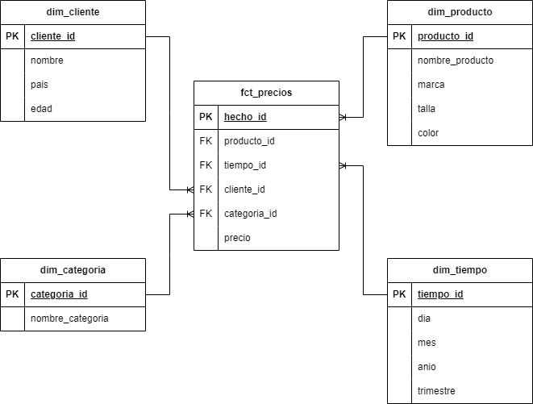
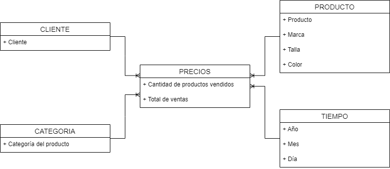

# XpertGroup Test - Análisis de Precios de Tienda Online de Ropa

Este proyecto fue desarrollado como parte del proceso de selección para XpertGroup. El objetivo principal es diseñar e implementar una solución completa para analizar y predecir los precios de productos de una tienda de ropa en línea, utilizando un enfoque basado en datos. El desarrollo abarca:

- **Preparación y limpieza de datos**: Procesamiento de los datos originales para eliminar valores nulos y duplicados.
- **Modelado en estrella**: Diseño de un modelo de base de datos optimizado para consultas analíticas.
- **Análisis exploratorio**: Identificación de patrones clave en los datos.
- **Modelamiento predictivo**: Implementación de un modelo de regresión para predecir los precios de los productos.
- **Visualización y resultados**: Generación de gráficos, métricas de rendimiento, y almacenamiento de predicciones en un formato centralizado.

Esta solución integra procesamiento de datos eficiente, modelamiento predictivo y visualización para facilitar decisiones basadas en datos en un entorno de negocio.

## Estructura del Proyecto

- `sources/`: Contiene la fuente de datos original en formato CSV.
  - `clothes_price_prediction_dat.csv`: Archivo con los datos originales de precios de ropa.

- `scripts/`: Incluye los scripts de limpieza, transformación y modelado:
  - `limpieza_datos.py`: Limpia los datos, eliminando valores nulos y duplicados, y los guarda en formato Parquet.
  - `modelo_predictivo.py`: Entrena un modelo predictivo y genera las predicciones en formato Parquet.

- `outputs/`: Almacena los datos transformados, predicciones y gráficos generados:
  - `cleaned_data.parquet`: Datos limpios y transformados después del procesamiento.
  - `predictions.parquet`: Archivo con las predicciones generadas por el modelo.
  - `comparacion_actual_vs_prediccion.png`: Gráfico de comparación entre valores reales y predicciones.
  - `distribucion_errores.png`: Gráfico de la distribución de errores del modelo.
  - `distribucion_precios.png`: Gráfico de la distribución de precios en el análisis exploratorio.
  - `metricas_predicciones.txt`: Contiene métricas como MAE y RMSE para evaluar el modelo.

- `notebooks/`: Contiene análisis exploratorios y de predicciones en Jupyter Notebooks:
  - `analisis_exploratorio.ipynb`: Análisis inicial del dataset, identificación de patrones y visualización.
  - `analisis_predicciones.ipynb`: Análisis detallado de las predicciones del modelo.

- `documentation/`: Incluye imágenes y diagramas para complementar la documentación:
  - `img.png`: Diagrama lógico del modelo en estrella.
  - `img_1.png`: Representación visual de la arquitectura general del proyecto.

- `README.md`: Archivo de documentación que describe el proyecto, su estructura, y cómo ejecutarlo.

## Requerimientos
- Python 3.8+
- Librerías:
  - pandas
  - numpy
  - matplotlib
  - seaborn
  - scikit-learn
  - pyarrow
  - fastparquet

---

## 1. Preparación y Exploración de Datos

Realizar la preparación y exploración inicial de un dataset relacionado con precios de ropa.

### Pasos para Ejecutar
1. Ejecutar `scripts/limpieza_datos.py` para limpiar el dataset.
2. Abrir y ejecutar `notebooks/análisis_exploratorio.ipynb` para realizar el análisis inicial.

---

## 2.  Modelado en estrella

El modelo en estrella es una estructura de base de datos utilizada para análisis en sistemas OLAP. En este modelo, los datos se organizan en una tabla de hechos rodeada de varias tablas de dimensiones. Vamos a diseñar este modelo en función del dataset proporcionado y las necesidades de análisis relacionadas con precios de ropa.

### Tablas del Modelo en Estrella

#### **Tabla de Hechos**
- **Tabla:** `fct_precios`
- **Descripción:** Contiene métricas cuantitativas relacionadas con los precios de productos.
- **Campos:**
  - `hecho_id` (PK): Identificador único.
  - `producto_id` (FK): Identificador del producto.
  - `tiempo_id` (FK): Fecha y hora del evento.
  - `cliente_id` (FK): Identificador del cliente (si aplica).
  - `categoria_id` (FK): Categoría del producto.
  - `precio`: Precio del producto.

#### **Tablas de Dimensiones**

1. **Dimensión Producto** (`dim_producto`):
   - **Campos:**
     - `producto_id` (PK): Identificador único del producto.
     - `nombre_producto`: Nombre del producto.
     - `marca`: Marca del producto.
     - `talla`: Talla del producto.
     - `color`: Color del producto.

2. **Dimensión Tiempo** (`dim_tiempo`):
   - **Campos:**
     - `tiempo_id` (PK): Fecha y hora del evento.
     - `dia`: Día del mes.
     - `mes`: Mes del año.
     - `anio`: Año.
     - `trimestre`: Trimestre del año.

3. **Dimensión Categoría** (`dim_categoria`):
   - **Campos:**
     - `categoria_id` (PK): Identificador único de la categoría.
     - `nombre_categoria`: Nombre de la categoría.

4. **Dimensión Cliente** (`dim_cliente`) *(opcional)*:
   - **Campos:**
     - `cliente_id` (PK): Identificador único del cliente.
     - `nombre`: Nombre del cliente.
     - `pais`: País del cliente.
     - `edad`: Edad del cliente.

Diagrama modelado en estrella

### Diagrama Lógico del Modelo en Estrella
El siguiente es el diagrama lógico que ilustra la relación entre la tabla de hechos y las dimensiones:

---

## 3. Modelo Predictivo

En esta fase, se implementó un modelo predictivo utilizando un algoritmo de **Random Forest Regressor** para predecir el precio de los productos basado en las características del dataset.

### Pasos del Modelado
1. **Preparación de Datos**:
   - Se seleccionaron las variables predictoras y la variable objetivo (`price`).
   - Las variables categóricas fueron codificadas mediante **One-Hot Encoding**.
   - Los datos se dividieron en conjuntos de entrenamiento y prueba.

2. **Entrenamiento del Modelo**:
   - Se utilizó **Random Forest Regressor** por su capacidad para manejar datos no lineales y su buen desempeño en problemas de regresión.
   - El modelo fue entrenado con un conjunto de datos del 80% y evaluado con el 20% restante.

3. **Evaluación del Modelo**:
   - Métricas utilizadas:
     - **Error Absoluto Medio (MAE):** Indica la magnitud promedio del error en las predicciones.
     - **Raíz del Error Cuadrático Medio (RMSE):** Evalúa el error con mayor sensibilidad a valores extremos.
   - Las predicciones se guardaron en el archivo `outputs/predictions.csv`.

### Justificación del Modelo Seleccionado
El algoritmo **Random Forest Regressor** fue seleccionado debido a las siguientes razones:
- **Capacidad para manejar datos no lineales**: Random Forest divide los datos en múltiples árboles de decisión y combina los resultados, lo que le permite capturar relaciones no lineales entre las variables.
- **Robustez frente a ruido**: Es menos sensible a valores atípicos en comparación con otros modelos como la regresión lineal.
- **Versatilidad**: Funciona bien tanto con variables categóricas como numéricas, adaptándose al dataset proporcionado.
- **Facilidad de interpretación**: Ofrece métricas como la importancia de las características, lo que permite identificar los factores más relevantes para el precio.

### Razones por las que no se eligieron otros Modelos
1. **Regresión Lineal**:
   - Es menos adecuada para datos con relaciones no lineales o complejas.
   - En pruebas iniciales, mostró mayor error debido a su suposición de linearidad entre las variables.

2. **Árboles de Decisión Simples**:
   - Aunque fáciles de interpretar, tienden a sobreajustar los datos, resultando en menor generalización.

3. **XGBoost**:
   - Es un modelo avanzado que podría haber ofrecido mejor precisión, pero tiene mayor complejidad computacional.
   - Se descartó en esta etapa para mantener una solución eficiente y fácilmente interpretable.
---
## 4. Almacenamiento y Resultados

### Almacenamiento en Formato Centralizado
Los datos transformados y los resultados generados por el modelo se almacenan en formato **Parquet**, lo que proporciona las siguientes ventajas:
- **Compresión y eficiencia**: Reducción del tamaño de almacenamiento.
- **Compatibilidad**: Integración directa con herramientas analíticas como Apache Spark, AWS Athena y Azure Synapse Analytics.
- **Velocidad de procesamiento**: Acceso rápido y lectura selectiva de columnas.

Archivos generados:
- `cleaned_data.parquet`: Datos transformados y listos para su análisis o modelado.
- `predictions.parquet`: Resultados de las predicciones del modelo.

### Pipeline Automatizado para Múltiples Nubes

#### Descripción del Proceso
El pipeline puede ser diseñado para procesar datos y almacenar los resultados en diferentes nubes públicas (AWS, Azure), permitiendo un flujo automatizado y centralizado. Los pasos clave son:

1. **Ingesta de Datos**:
   - Orquestadores como **AWS Glue**, **Azure Data Factory** o **Apache Airflow** pueden extraer datos desde fuentes como S3, Azure Blob Storage o Google Cloud Storage.

2. **Procesamiento de Datos**:
   - Utilizar plataformas como **AWS Lambda** o **Azure Functions** para ejecutar los scripts de limpieza y transformación de datos.
   - Procesar grandes volúmenes de datos con servicios como **Databricks** o **Amazon EMR**.

3. **Almacenamiento**:
   - Guardar los datos transformados y resultados en:
     - **AWS S3**: Datos accesibles mediante Amazon Athena para consultas SQL.
     - **Azure Data Lake Storage**: Compatible con análisis en Synapse Analytics.
     - **Google Cloud Storage**: Integración con BigQuery para análisis avanzado.

4. **Resultados Centralizados**:
   - Almacenar los resultados en formatos **Parquet** o **JSON** en cada nube, optimizando la compatibilidad entre plataformas.

5. **Automatización**:
   - Configurar un pipeline con **Apache Airflow** o **Azure Data Factory** para ejecutar cada paso del flujo:
     - Orquestar el procesamiento.
     - Enviar notificaciones al completar los procesos.
     - Controlar versiones de los datos.